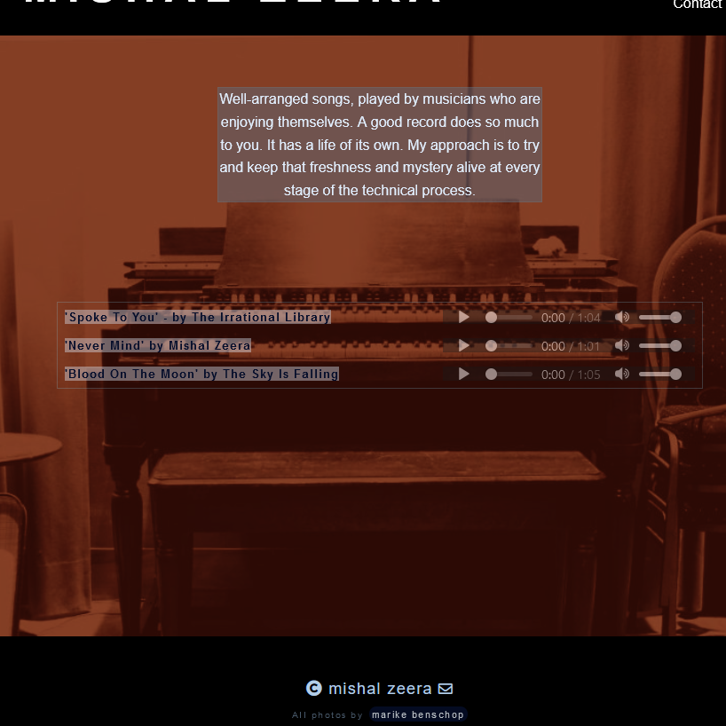

# Milestone Project 1

## Website for my music production services

### Purpose of the site

I want to have a site that inspires confidence in my production services to a first time client. I initially intended to use funny audio samples to entertain and provoke interest. The snippets would in theory double as a proof of ability. However, after consulting with a sensible person, I came to the decision that it is better to just show a selection of my work.

### Value of the site

The difficulty is: communicating the musical and organisational skills of a music producer to a generation of clients who think our work is entirely technical. The site has value to a musical artist who is concerned their musical vision is compromised - by their financial means, technical knowhow and lack of trustworthy feedback. For that person, the combination of persuasive reasoning and audio media would inspire the thought "Aha, this is exactly the combination of practical ability and creative orientation I am looking for." I would like people who are hesitant or unfamiliar with the lingo to feel welcome, by not using overly technical or cliquey language.

Derek Sivers of CD Baby gives this advice: "find out who it is that you dont mind alienating, it will make your marketing strategy a lot clearer". In this case, I have very clear ideas of who I want to avoid:

#### People who just want the cheapest service available.

The overall design aesthetic should communicate quality, and make people expect to pay a working professionals fee. I will not publish any price rates or mention any kind of special deals on the site either. Its probably not going to deter every "free-work-seeker" but I like that as a starting point. It is very common that we waste a lot of time on people who want us to work for free. Usually the serious ones have no issue with our modest rates, and know that the reality of the process often means we go above and beyond what is remunerated. Of course I can't make that explicit ("NO TIMEWASTERS! is very offputting and the ghost of print ads of yore).

#### People who don't take their art seriously.

The artist/producer work process should be meaningful - a collaboration that is focused on making something special together. By making the sound snippets feature a wide variety of styles, I am hoping the sum of the difference communicates: "what this guy does is chameleonlike so its up to me to be the deciding creative force in this relationship". While sometimes the need to have income makes us slide on this issue a bit, it can really work against your reputation eventually.

## Deployment procedure

Having struggled a bit with Bootstrap, I am relieved that it isn't strictly necessary for this project. I may end up using some features, but at the outset am leaning away from it. Kevin Powell's videos on Youtube have been a fantastic resource to learn CSS Flexbox and CSS Grid.

### Mobile first approach

I reduced the site down to 4 pages, including the index. It made more sense and kept things more focused.

First thing (after setting fonts and colours) will be making my index.html page and a basic footer. Footer has no social media links, since I don't use it very much. It will have some sort of a fun icon and maybe a (c) mainly for the visual accent.

Copy and paste the nav and footer to all pages.

Add background images and text areas in a block approach.

Margins, paddings, max-widths so that on a mobile view everything is nicely spaced.

Add audio resources and style them.

### Media queries

At a reasonable breakpoint, I will use media queries to organise the site into rows and columns. I intend to use either the display:grid or flex property as the heart of that. Each page will be a little bit different, but at the most complex I will still only have two columns for the main section. There may be a card at some point with a more complex nested grid structure, but I will wait to decide once I have done some more work.

### Other peoples codes and ideas

Instead of going for Bootstrap, I shall follow a CSS layout approach I have learned in other online resources. This is mostly because it makes the fundamentals feel clearer to myself, and comes more naturally to me.

If I do end up using Bootstrap, I will of course use their code snippets as a starting place.

### Figma screenshots

Looking for the right image for the Rec/Mix page, but for now I am using this as a placeholder. Also, have yet to pick an accent colour out. I don't want a strictly black and white site, at least at this point... Fonts are also still being chosen. UPDATE: I have gone with a background-blend-mode approach, using a background default color (which is good in case an image fails to load). By reducing the opacity of the images, the contrast with the text colour improves as well.

## Home page

## Production page

## Recording/Mixing page

## Composition page

## Contact Page

## HTML validation issue

The message "The value of the for attribute of the label element must be the ID of a non-hidden form control." comes up when I validate the markup for the pages including the audio player. From what I understand, the label element is often used outside of the form context to accomplish other ends, so I will continue with the use of it til I learn otherwise.

Also, in the contact page, within the form element - method="#" comes up as an error. I am using that as a placeholder til I learn how to properly assign it.

Css validated without errors.

## 'Screenshots that align with the goal'

### Text/ no text

At small sizes, the blurbs for the main body disappear. Like this-->

### Which...

...it seems to me makes for a less cluttered mobile experience. The background image works more like a main content for the moment. Then when you touch one of the other options, its clear enough that you can press "play" and hear samples.

### Active class nav items that reinforce design decisions

I thought this was a good way to reinforce the image and colour choices, by including background blend colour in the active class. To me it reinforces the intention of a simple, cohesive design approach.

### Audio players that don't overly dominate the territory...

The default audio player is far too chunky. I slimmed it down and tried to fit it in a little better.

### Footer contact link and credit link understated

I decided against a complex, link-heavy footer for the main reason that the social media that pertains is too diverse and inconsistent. There is no Instagram page and the Facebook page is more personal than promotional. Also, I would really like people to listen to the audio examples and then simply contact me if they feel it is a right fit. By limiting the decision making to just those things, I think it might lead to a better outcome.

# Video resources

I relied heavily on one particular guy called Kevin Powell's videos on Youtube and Scrimba to learn more about CSS. Here are some links to videos I found helpful - bear in mind these are just a tiny sample, I watched a lot of them, including short CSS bootcamp tutorials.

[KP Responsive design made easy](https://www.youtube.com/watch?v=bn-DQCifeQQ)

[KP Building a CSS Grid layout](https://www.youtube.com/watch?v=v5KzBPUEgGQ)

[Responsive design bootcamp](https://scrimba.com/learn/responsive)
